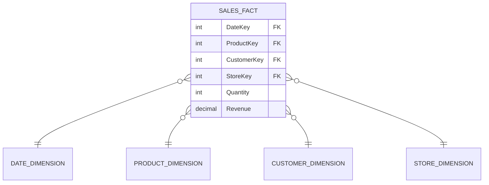

## Data Consistency, Redundancy, and Independence

### Data Consistency

<div class="key-term" markdown="1">
**Data consistency** means that all copies and representations of a data item agree with each other. If a customer's address is stored in multiple places, every instance must hold the same value at any given time.
</div>

In a flat-file system, the same data is often duplicated across many files. When one copy is updated but others are not, the data becomes **inconsistent**. A database approach addresses this by storing each data item once and providing controlled access to it.

### Data Redundancy

<div class="key-term" markdown="1">
**Data redundancy** is the unnecessary duplication of data. In a flat-file system, the same information (e.g. a customer name and address) may be stored in the orders file, the invoices file, and the accounts file.
</div>

Problems caused by redundancy:

- **Wasted storage** — the same data occupies space in multiple files
- **Update anomalies** — changing data in one file but not others leads to inconsistency
- **Insert anomalies** — data cannot be added without creating a related record (e.g. cannot store a new customer without an order)
- **Delete anomalies** — deleting a record may accidentally remove the only copy of important data

### Data Independence

<div class="key-term" markdown="1">
**Data independence** is the ability to change the way data is stored or organised without affecting the programs that use it.
</div>

| Type | Description | Example |
|------|-------------|---------|
| **Logical data independence** | Changes to the logical structure (e.g. adding a field, creating a new view) do not require changes to application programs | Adding a "mobile number" field to a customer table does not break existing queries that do not use that field |
| **Physical data independence** | Changes to the physical storage (e.g. moving to a different disk, changing file organisation) do not affect the logical structure or applications | Moving a database from a hard drive to an SSD requires no changes to SQL queries |

Data independence is achieved through the **three-schema architecture** of a DBMS:

1. **External schema** — individual user views
2. **Conceptual schema** — the logical structure of the entire database
3. **Internal schema** — the physical storage structure

---

## Relational Database Concepts

### Key Terminology

| Formal Term | Informal Equivalent | Meaning |
|-------------|-------------------|---------|
| **Relation** | Table | A two-dimensional structure storing data about one entity |
| **Attribute** | Column / Field | A named property of the entity (e.g. Surname, DateOfBirth) |
| **Tuple** | Row / Record | A single instance of the entity with values for each attribute |
| **Domain** | Data type / Range | The set of allowable values for an attribute |

### Types of Keys

| Key Type | Definition | Example |
|----------|-----------|---------|
| **Primary key** | An attribute (or combination) that uniquely identifies each tuple in a relation | StudentID in a Students table |
| **Foreign key** | An attribute in one relation that references the primary key of another relation, creating a link between them | StudentID in an Enrolments table referencing Students |
| **Composite key** | A primary key made up of two or more attributes together | (StudentID, ModuleID) in an Enrolments table |
| **Candidate key** | Any attribute (or combination) that could serve as the primary key — there may be several candidates | Both StudentID and NationalInsuranceNumber could uniquely identify a student |

<div class="exam-tip" markdown="1">
In an exam, when identifying keys, look for attributes that are **unique** and **never null**. If no single attribute is unique, consider whether a **combination** of attributes could form a composite key. The primary key is the candidate key that is actually chosen for use.
</div>

---

## Normalisation

Normalisation is the process of organising data in a relational database to **reduce redundancy** and **eliminate anomalies**. Data is progressively restructured through a series of **normal forms**.

### Worked Example

Consider a flat-file table for a school's course enrolment system:

**StudentCourses (Unnormalised)**

| StudentID | StudentName | Tutor | TutorRoom | CourseID | CourseName | Grade |
|-----------|-------------|-------|-----------|----------|------------|-------|
| S1 | Anna Jones | Mr Smith | R101 | C1, C3 | Maths, Physics | A, B |
| S2 | Ben Lee | Ms Patel | R204 | C1, C2 | Maths, English | B, A |
| S3 | Clara Diaz | Mr Smith | R101 | C2 | English | C |

This table has **repeating groups** (CourseID, CourseName, Grade can have multiple values per student) — it is in **UNF (Unnormalised Form)**.

### UNF to 1NF — Remove Repeating Groups

<div class="key-term" markdown="1">
**First Normal Form (1NF):** A relation is in 1NF if it contains no repeating groups and every field contains only **atomic** (indivisible) values. Each row must be uniquely identifiable.
</div>

To achieve 1NF, separate the repeating groups so each cell contains a single value. Each row must be unique, so we need a **composite primary key**: (StudentID, CourseID).

**StudentCourses (1NF)**

| **StudentID** | StudentName | Tutor | TutorRoom | **CourseID** | CourseName | Grade |
|-----------|-------------|-------|-----------|----------|------------|-------|
| S1 | Anna Jones | Mr Smith | R101 | C1 | Maths | A |
| S1 | Anna Jones | Mr Smith | R101 | C3 | Physics | B |
| S2 | Ben Lee | Ms Patel | R204 | C1 | Maths | B |
| S2 | Ben Lee | Ms Patel | R204 | C2 | English | A |
| S3 | Clara Diaz | Mr Smith | R101 | C2 | English | C |

Composite primary key: **(StudentID, CourseID)**

### 1NF to 2NF — Remove Partial Dependencies

<div class="key-term" markdown="1">
**Second Normal Form (2NF):** A relation is in 2NF if it is in 1NF and every non-key attribute is **fully functionally dependent** on the **whole** primary key (no partial dependencies).
</div>

A **partial dependency** exists when a non-key attribute depends on only **part** of a composite key.

In our 1NF table:
- StudentName, Tutor, TutorRoom depend only on **StudentID** (not on CourseID) — partial dependency
- CourseName depends only on **CourseID** (not on StudentID) — partial dependency
- Grade depends on **both StudentID and CourseID** — full dependency

To achieve 2NF, split the table so that each non-key attribute depends on the entire key:

**Students**

| **StudentID** | StudentName | Tutor | TutorRoom |
|-----------|-------------|-------|-----------|
| S1 | Anna Jones | Mr Smith | R101 |
| S2 | Ben Lee | Ms Patel | R204 |
| S3 | Clara Diaz | Mr Smith | R101 |

**Courses**

| **CourseID** | CourseName |
|----------|------------|
| C1 | Maths |
| C2 | English |
| C3 | Physics |

**Enrolments**

| **StudentID** | **CourseID** | Grade |
|-----------|----------|-------|
| S1 | C1 | A |
| S1 | C3 | B |
| S2 | C1 | B |
| S2 | C2 | A |
| S3 | C2 | C |

### 2NF to 3NF — Remove Transitive Dependencies

<div class="key-term" markdown="1">
**Third Normal Form (3NF):** A relation is in 3NF if it is in 2NF and there are no **transitive dependencies** — no non-key attribute depends on another non-key attribute.
</div>

A **transitive dependency** exists when a non-key attribute determines another non-key attribute.

In the Students table: Tutor determines TutorRoom (each tutor is always in the same room). So TutorRoom is transitively dependent on StudentID via Tutor:

```
StudentID → Tutor → TutorRoom
```

To achieve 3NF, separate out the transitive dependency:

**Students (3NF)**

| **StudentID** | StudentName | Tutor |
|-----------|-------------|-------|
| S1 | Anna Jones | Mr Smith |
| S2 | Ben Lee | Ms Patel |
| S3 | Clara Diaz | Mr Smith |

**Tutors (3NF)**

| **Tutor** | TutorRoom |
|-------|-----------|
| Mr Smith | R101 |
| Ms Patel | R204 |

**Final 3NF Schema:**
- **Students** (***StudentID***, StudentName, Tutor*)
- **Courses** (***CourseID***, CourseName)
- **Enrolments** (***StudentID****, ***CourseID****, Grade)
- **Tutors** (***Tutor***, TutorRoom)

*Italic with asterisk = foreign key, Bold italic with asterisk = primary key*

<div class="exam-tip" markdown="1">
Normalisation questions are very common in the exam and carry significant marks. Always show each step clearly: identify the repeating groups (UNF to 1NF), identify partial dependencies (1NF to 2NF), then identify transitive dependencies (2NF to 3NF). Underline primary keys and mark foreign keys clearly.
</div>

---

## Entity Relationship Modelling

### Relationships Between Entities

An **entity** is a thing about which data is stored (e.g. Student, Course, Teacher). Entities have **relationships** with each other.

| Relationship | Meaning | Example |
|-------------|---------|---------|
| **One-to-one (1:1)** | Each instance of entity A is related to exactly one instance of entity B, and vice versa | One headteacher manages one school |
| **One-to-many (1:M)** | Each instance of entity A can be related to many instances of entity B, but each B relates to only one A | One tutor teaches many students; each student has one tutor |
| **Many-to-many (M:M)** | Each instance of entity A can be related to many instances of entity B, and vice versa | Many students enrol on many courses |

### ER Diagram Notation

Entities are drawn as **rectangles**, relationships as **lines** between them, with the degree of the relationship marked:

```
[Student] 1 -------- M [Enrolment] M -------- 1 [Course]
```

### Resolving Many-to-Many Relationships

Relational databases **cannot directly implement** many-to-many relationships. They must be resolved using a **junction table** (also called a linking table or associative entity).

**Before resolution:**
```
[Student] M -------- M [Course]
```

**After resolution:**
```
[Student] 1 -------- M [Enrolment] M -------- 1 [Course]
```

The **Enrolment** junction table contains the primary keys of both Student and Course as foreign keys (which together form a composite primary key), plus any attributes specific to the relationship (e.g. Grade, EnrolmentDate).

---

## SQL — Structured Query Language

### Data Query Language (DQL)

#### SELECT, FROM, WHERE

```sql
-- Select all columns from a table
SELECT * FROM Students;

-- Select specific columns
SELECT StudentName, Tutor FROM Students;

-- Filter with WHERE
SELECT StudentName, Grade
FROM Enrolments
INNER JOIN Students ON Enrolments.StudentID = Students.StudentID
WHERE Grade = 'A';

-- Multiple conditions
SELECT * FROM Students
WHERE Tutor = 'Mr Smith' AND StudentName LIKE 'A%';
```

#### ORDER BY and GROUP BY

```sql
-- Sort results
SELECT StudentName, Grade FROM Enrolments
INNER JOIN Students ON Enrolments.StudentID = Students.StudentID
ORDER BY StudentName ASC;

-- Group and aggregate
SELECT CourseID, COUNT(*) AS NumberOfStudents
FROM Enrolments
GROUP BY CourseID;

-- HAVING filters groups (WHERE filters individual rows)
SELECT CourseID, COUNT(*) AS NumberOfStudents
FROM Enrolments
GROUP BY CourseID
HAVING COUNT(*) > 1;
```

#### JOIN Operations

```sql
-- INNER JOIN: returns only matching rows from both tables
SELECT Students.StudentName, Courses.CourseName, Enrolments.Grade
FROM Enrolments
INNER JOIN Students ON Enrolments.StudentID = Students.StudentID
INNER JOIN Courses ON Enrolments.CourseID = Courses.CourseID;

-- LEFT JOIN: returns all rows from the left table, with NULLs where there is no match
SELECT Students.StudentName, Enrolments.CourseID
FROM Students
LEFT JOIN Enrolments ON Students.StudentID = Enrolments.StudentID;
```

| Join Type | Returns |
|-----------|---------|
| **INNER JOIN** | Only rows where there is a match in **both** tables |
| **LEFT JOIN** | All rows from the **left** table, plus matched rows from the right (NULLs where no match) |

### Data Manipulation Language (DML)

```sql
-- INSERT a new record
INSERT INTO Students (StudentID, StudentName, Tutor)
VALUES ('S4', 'David Park', 'Ms Patel');

-- UPDATE an existing record
UPDATE Enrolments
SET Grade = 'A'
WHERE StudentID = 'S3' AND CourseID = 'C2';

-- DELETE a record
DELETE FROM Enrolments
WHERE StudentID = 'S1' AND CourseID = 'C3';
```

### Data Definition Language (DDL)

```sql
-- CREATE TABLE
CREATE TABLE Students (
    StudentID VARCHAR(5) PRIMARY KEY,
    StudentName VARCHAR(50) NOT NULL,
    Tutor VARCHAR(30),
    FOREIGN KEY (Tutor) REFERENCES Tutors(Tutor)
);

CREATE TABLE Enrolments (
    StudentID VARCHAR(5),
    CourseID VARCHAR(5),
    Grade CHAR(1),
    PRIMARY KEY (StudentID, CourseID),
    FOREIGN KEY (StudentID) REFERENCES Students(StudentID),
    FOREIGN KEY (CourseID) REFERENCES Courses(CourseID)
);
```

<div class="exam-tip" markdown="1">
SQL questions in the exam expect correct syntax. Remember: **WHERE** filters individual rows before grouping; **HAVING** filters groups after aggregation. Use **INNER JOIN** when you only want matching records, and **LEFT JOIN** when you need all records from one table regardless of whether they match.
</div>

---

## Purpose of a DBMS

A **Database Management System (DBMS)** is software that manages access to the database, acting as an intermediary between users/applications and the stored data.

### Key Functions

| Function | Description |
|----------|-------------|
| **Data dictionary** | Stores metadata — descriptions of tables, fields, data types, constraints, relationships, and access permissions. Sometimes called the "database about the database" |
| **Security** | Controls access through user authentication, authorisation levels, and access rights (read, write, modify, delete). Different users can have different views of the data |
| **Backup and recovery** | Provides tools for regular backups and transaction logs to restore the database to a consistent state after a failure |
| **Concurrent access** | Manages multiple users accessing the database simultaneously using locking, timestamps, or serialisation to prevent conflicts |
| **Query processing** | Translates high-level queries (SQL) into low-level operations, optimises query execution plans for efficiency |
| **Data integrity** | Enforces constraints (e.g. primary key uniqueness, referential integrity, data validation rules) to maintain data accuracy |

<div class="key-term" markdown="1">
A **data dictionary** (also called the system catalogue) contains metadata about every object in the database: table names, field names, data types, constraints, relationships, indexes, and user access rights. It is maintained automatically by the DBMS.
</div>

---

## Big Data

### Characteristics of Big Data

Big Data is commonly described by the **four Vs**:

| Characteristic | Description | Example |
|---------------|-------------|---------|
| **Volume** | Extremely large amounts of data — terabytes to petabytes | Social media generates petabytes of data daily |
| **Velocity** | Data is generated and must be processed at high speed, often in real time | Stock market transactions, sensor data from IoT devices |
| **Variety** | Data comes in many formats — structured (databases), semi-structured (XML, JSON), unstructured (text, images, video) | Combining sales databases with social media posts and customer reviews |
| **Veracity** | The quality, accuracy, and trustworthiness of the data varies | Sensor data may contain errors; social media data may be biased or false |

### Predictive Analytics

<div class="key-term" markdown="1">
**Predictive analytics** uses statistical techniques and machine learning on historical data to make predictions about future events or behaviours.
</div>

Applications of predictive analytics:

- **Retail:** Predicting which products a customer is likely to buy, optimising stock levels
- **Healthcare:** Predicting disease outbreaks, identifying patients at risk of readmission
- **Finance:** Credit scoring, fraud detection, market trend prediction
- **Transport:** Predicting traffic congestion, optimising delivery routes

### Machine Learning Applications

Machine learning is a subset of artificial intelligence where systems learn patterns from data without being explicitly programmed for each task.

| Application | Description |
|-------------|-------------|
| **Recommendation systems** | Netflix suggests films; Amazon suggests products based on past behaviour |
| **Natural language processing** | Voice assistants (Siri, Alexa) understand and respond to speech |
| **Image recognition** | Medical imaging analysis, facial recognition, autonomous vehicles |
| **Fraud detection** | Banks identify unusual transaction patterns automatically |
| **Spam filtering** | Email systems classify messages as spam or legitimate |

---

## Data Warehousing

### What Is a Data Warehouse?

<div class="key-term" markdown="1">
A **data warehouse** is a large, centralised repository that stores historical data from multiple operational sources, organised specifically for analysis and reporting rather than day-to-day transaction processing.
</div>

### ETL Process

Data enters the warehouse through the **ETL** process:

| Stage | Action | Detail |
|-------|--------|--------|
| **Extract** | Pull data from multiple sources | Operational databases, spreadsheets, external feeds, log files |
| **Transform** | Clean, standardise, and restructure the data | Remove duplicates, convert formats, apply business rules, handle missing values |
| **Load** | Write the processed data into the warehouse | May be done in bulk (batch) or incrementally |

### Star Schema

The star schema is the most common data warehouse design:

- A central **fact table** contains measurable business data (e.g. sales amount, quantity sold) and foreign keys to dimension tables
- Surrounding **dimension tables** contain descriptive attributes (e.g. product name, customer location, date)



The fact table holds: DateKey, ProductKey, CustomerKey, StoreKey, Quantity, Revenue

### OLAP vs OLTP

| Feature | OLTP (Online Transaction Processing) | OLAP (Online Analytical Processing) |
|---------|--------------------------------------|--------------------------------------|
| **Purpose** | Day-to-day operations | Analysis and reporting |
| **Queries** | Simple, frequent (INSERT, UPDATE) | Complex, infrequent (aggregations, joins) |
| **Data** | Current, detailed | Historical, summarised |
| **Users** | Many concurrent users (clerks, customers) | Few users (analysts, managers) |
| **Design** | Normalised (3NF) for minimal redundancy | Denormalised (star schema) for query speed |
| **Response time** | Milliseconds | Seconds to minutes acceptable |

---

## Data Mining

### What Is Data Mining?

<div class="key-term" markdown="1">
**Data mining** is the process of discovering patterns, correlations, and anomalies in large datasets using statistical and computational techniques to make predictions or gain insights.
</div>

### Techniques

| Technique | Description | Example |
|-----------|-------------|---------|
| **Classification** | Assigns data items to predefined categories based on attributes | Classifying emails as spam or not spam; classifying loan applicants as high or low risk |
| **Clustering** | Groups data items by similarity without predefined categories | Grouping customers by purchasing behaviour to identify market segments |
| **Association rules** | Finds relationships between items that frequently occur together | "Customers who buy bread and butter also tend to buy milk" (market basket analysis) |

### Applications of Data Mining

- **Retail:** Market basket analysis to optimise product placement and promotions
- **Healthcare:** Identifying patterns in patient data to improve diagnoses and treatment plans
- **Banking:** Detecting fraudulent transactions by identifying unusual patterns
- **Telecommunications:** Predicting customer churn (customers likely to leave)
- **Science:** Discovering patterns in genomic data, climate data, or astronomical observations

<div class="exam-tip" markdown="1">
Data mining and data warehousing are closely related. The warehouse provides the clean, organised historical data that mining techniques analyse. Be prepared to explain the difference: the warehouse **stores** the data; mining **discovers patterns** within it.
</div>

---

## Distributed Databases

### What Is a Distributed Database?

<div class="key-term" markdown="1">
A **distributed database** is a database where the data is stored across multiple computers (nodes) at different physical locations, but appears to users as a single, unified database.
</div>

### Fragmentation

Data can be distributed across nodes using two methods:

| Type | Description | Example |
|------|-------------|---------|
| **Horizontal fragmentation** | Different **rows** of a table are stored at different nodes | Customer records for Wales stored on the Cardiff server; records for England stored on the London server |
| **Vertical fragmentation** | Different **columns** of a table are stored at different nodes | Customer name and address stored at one node; financial details stored at a more secure node |

A combination of both (mixed fragmentation) is also possible.

### Replication

**Replication** means storing copies of the same data at multiple nodes.

| Replication Type | Description |
|-----------------|-------------|
| **Full replication** | Every node holds a complete copy of the entire database |
| **Partial replication** | Frequently accessed data is copied to multiple nodes; other data exists at only one node |
| **No replication** | Each data item exists at exactly one node |

### Advantages of Distributed Databases

| Advantage | Explanation |
|-----------|-------------|
| **Reliability** | If one node fails, others continue operating; data is not lost if replicated |
| **Performance** | Data is stored close to where it is used most, reducing network traffic and response times |
| **Scalability** | New nodes can be added to handle growth without redesigning the entire system |
| **Local autonomy** | Each site can control its own data while still participating in the larger system |

### Challenges of Distributed Databases

| Challenge | Explanation |
|-----------|-------------|
| **Data consistency** | Keeping all copies of data synchronised across nodes is difficult, especially with replication |
| **Complexity** | The DBMS must handle distributed query processing, distributed transactions, and failure recovery across multiple nodes |
| **Network dependency** | The system relies on network connections; if a link fails, some data may become temporarily inaccessible |
| **Security** | Data transmitted between nodes must be protected; more nodes means more potential attack points |
| **Cost** | Hardware, software, and administration costs are higher than a centralised database |

<div class="exam-tip" markdown="1">
Exam questions on distributed databases often ask you to weigh advantages against challenges for a given scenario. Consider factors like the geographic spread of users, the need for reliability, the importance of consistency, and the available budget. A company with offices worldwide benefits from distributed databases; a small local business may not.
</div>
