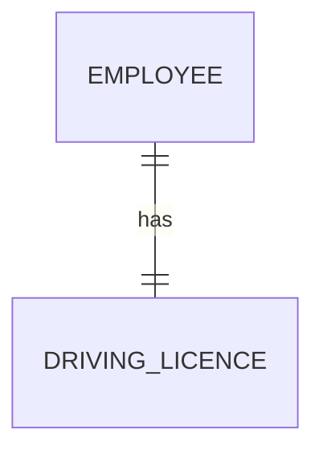
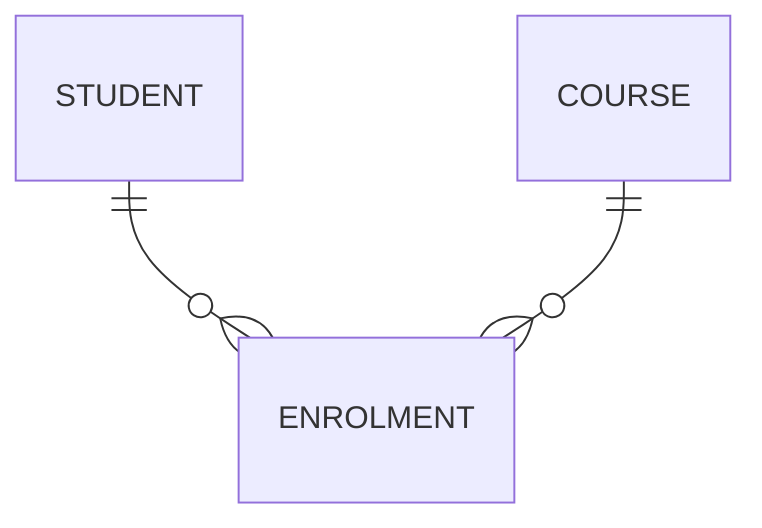

## Flat File vs Relational Databases

### Flat File Database

A **flat file database** stores all data in a **single table** (or file). Every record contains all the data, which often leads to significant **data redundancy** (the same data stored multiple times).

**Example — Flat File:**

| StudentID | StudentName | CourseID | CourseName | TutorName |
|---|---|---|---|---|
| S101 | Alice | C1 | Maths | Mr Smith |
| S102 | Bob | C1 | Maths | Mr Smith |
| S103 | Charlie | C2 | English | Ms Jones |
| S101 | Alice | C2 | English | Ms Jones |

**Problems with flat files:**
- **Data redundancy** — "Maths", "Mr Smith" repeated for every student on that course
- **Data inconsistency** — if Mr Smith changes his name, it must be updated in every row
- **Insertion anomaly** — cannot add a new course without assigning a student to it
- **Deletion anomaly** — deleting the last student on a course removes all data about that course
- **Update anomaly** — changing a course name requires updating multiple rows

### Relational Database

A **relational database** stores data across **multiple linked tables**, each representing a single entity. Tables are linked through **key fields**, eliminating redundancy and the anomalies listed above.

<div class="key-term" markdown="1">
A **flat file database** stores all data in one table, leading to redundancy and anomalies. A **relational database** stores data in multiple linked tables, reducing redundancy and improving data integrity.
</div>

### Comparison

| Feature | Flat File | Relational Database |
|---|---|---|
| **Structure** | Single table | Multiple linked tables |
| **Redundancy** | High | Low (data stored once) |
| **Data integrity** | Poor (inconsistencies likely) | High (enforced through keys and constraints) |
| **Anomalies** | Insertion, deletion, update anomalies | Eliminated through normalisation |
| **Complexity** | Simple to set up | More complex structure |
| **Storage** | Wastes space | Efficient use of storage |
| **Querying** | Limited | Powerful querying with SQL |

---

## Entity-Relationship Diagrams

An **entity-relationship (E-R) diagram** is a visual representation of the entities in a database and the relationships between them. Entities are represented as rectangles and relationships as lines connecting them.

<div class="key-term" markdown="1">
An **entity** is a real-world object or concept about which data is stored (e.g., Student, Course, Teacher). A **relationship** describes how entities are associated with each other.
</div>

### Types of Relationships

There are three types of relationships between entities:

### One-to-One (1:1)

Each instance of Entity A is associated with **exactly one** instance of Entity B, and vice versa.

**Example:** Each `Employee` has one `DrivingLicence`, and each `DrivingLicence` belongs to one `Employee`.



### One-to-Many (1:M)

Each instance of Entity A can be associated with **many** instances of Entity B, but each instance of Entity B is associated with only **one** instance of Entity A.

**Example:** One `Tutor` teaches many `Students`, but each `Student` has only one `Tutor`.


This is the most common relationship type. It is implemented by placing the primary key of the "one" side as a **foreign key** in the table on the "many" side.

### Many-to-Many (M:M)

Each instance of Entity A can be associated with **many** instances of Entity B, and vice versa.

**Example:** A `Student` can enrol on many `Courses`, and each `Course` can have many `Students`.


**Important:** A many-to-many relationship **cannot be directly implemented** in a relational database. It must be resolved by creating a **junction table** (also called a linking table or associative entity) that sits between the two tables, converting the M:M relationship into two 1:M relationships.



The `Enrolment` table typically contains the primary keys of both `Student` and `Course` as foreign keys.

<div class="exam-tip" markdown="1">
In the exam, you may be asked to draw an E-R diagram or identify relationship types. Remember that **many-to-many** relationships must be decomposed using a **junction table**. The foreign key always goes on the **"many" side** of a 1:M relationship.
</div>

---

## Keys

Keys are fields that serve special purposes in a relational database, used to uniquely identify records and create relationships between tables.

### Primary Key

A **primary key** is a field (or combination of fields) that **uniquely identifies** each record in a table. Every table must have a primary key.

**Rules for primary keys:**
- Must be **unique** — no two records can have the same primary key value
- Must be **not null** — every record must have a value for the primary key
- Should be **stable** — the value should not change over time
- Should be **minimal** — use the fewest fields necessary

**Example:** `StudentID` in a `Student` table — each student has a unique ID.

### Foreign Key

A **foreign key** is a field in one table that **references the primary key** of another table. Foreign keys create the **links** (relationships) between tables.

**Example:** `TutorID` in the `Student` table is a foreign key that references `TutorID` (the primary key) in the `Tutor` table.

### Composite Key

A **composite key** is a primary key made up of **two or more fields combined**. Individually, neither field is unique, but together they uniquely identify a record.

**Example:** In an `Enrolment` table (junction table), neither `StudentID` nor `CourseID` alone is unique (a student takes many courses, and a course has many students). Together, the combination of `StudentID` + `CourseID` uniquely identifies each enrolment.

| StudentID (FK/PK) | CourseID (FK/PK) | EnrolmentDate |
|---|---|---|
| S101 | C1 | 01/09/2025 |
| S101 | C2 | 01/09/2025 |
| S102 | C1 | 01/09/2025 |

The composite primary key is (`StudentID`, `CourseID`).

### Secondary Key

A **secondary key** is a field that is not the primary key but is used frequently for **searching or sorting**. An index is typically created on secondary keys to speed up queries.

**Example:** `Surname` in a `Student` table — not unique, but frequently searched.

<div class="key-term" markdown="1">
A **primary key** uniquely identifies each record. A **foreign key** is a field in one table that references the primary key of another table. A **composite key** is a primary key made up of two or more fields.
</div>

### Summary of Key Types

| Key Type | Purpose | Example |
|---|---|---|
| **Primary Key** | Uniquely identifies each record in a table | `StudentID` |
| **Foreign Key** | Links one table to another (references a primary key) | `TutorID` in Student table |
| **Composite Key** | A primary key made up of two or more fields | (`StudentID`, `CourseID`) |
| **Secondary Key** | Used for searching/sorting, indexed for speed | `Surname` |

---

## Normalisation

**Normalisation** is the process of organising a database to **reduce data redundancy** and **eliminate anomalies** (insertion, deletion, and update anomalies). It involves splitting a flat file into related tables through a series of **normal forms**.

<div class="key-term" markdown="1">
**Normalisation** is a systematic process of decomposing tables to eliminate data redundancy and dependency anomalies, progressing through First Normal Form (1NF), Second Normal Form (2NF), and Third Normal Form (3NF).
</div>

### Worked Example

Consider this un-normalised data for a school system:

**Un-normalised (UNF):**

| StudentID | StudentName | Courses |
|---|---|---|
| S101 | Alice | Maths, English, Physics |
| S102 | Bob | Maths, Chemistry |
| S103 | Charlie | English, Chemistry, Art |

Problems: The `Courses` field contains **repeating groups** (multiple values in one field).

### First Normal Form (1NF)

**Rule:** A table is in 1NF if:
- All fields contain **atomic** (single, indivisible) values — no repeating groups
- Each record is unique (has a primary key)

**Solution:** Remove repeating groups by creating a separate row for each course:

| StudentID | StudentName | CourseID | CourseName |
|---|---|---|---|
| S101 | Alice | C1 | Maths |
| S101 | Alice | C2 | English |
| S101 | Alice | C3 | Physics |
| S102 | Bob | C1 | Maths |
| S102 | Bob | C4 | Chemistry |
| S103 | Charlie | C2 | English |
| S103 | Charlie | C4 | Chemistry |
| S103 | Charlie | C5 | Art |

The composite primary key is (`StudentID`, `CourseID`).

This is now in **1NF** but still has redundancy (e.g., "Alice" is repeated, "Maths" is repeated).

### Second Normal Form (2NF)

**Rule:** A table is in 2NF if:
- It is already in 1NF
- Every non-key field depends on the **whole** primary key (no **partial dependencies**)

A **partial dependency** occurs when a non-key field depends on only **part** of a composite key.

In the 1NF table above:
- `StudentName` depends only on `StudentID` (not on the full key `StudentID + CourseID`) — **partial dependency**
- `CourseName` depends only on `CourseID` (not on the full key) — **partial dependency**

**Solution:** Split into separate tables to remove partial dependencies:

**Student Table:**

| StudentID (PK) | StudentName |
|---|---|
| S101 | Alice |
| S102 | Bob |
| S103 | Charlie |

**Course Table:**

| CourseID (PK) | CourseName |
|---|---|
| C1 | Maths |
| C2 | English |
| C3 | Physics |
| C4 | Chemistry |
| C5 | Art |

**Enrolment Table (junction table):**

| StudentID (FK/PK) | CourseID (FK/PK) |
|---|---|
| S101 | C1 |
| S101 | C2 |
| S101 | C3 |
| S102 | C1 |
| S102 | C4 |
| S103 | C2 |
| S103 | C4 |
| S103 | C5 |

This is now in **2NF** — every non-key attribute depends on the whole of its table's primary key.

### Third Normal Form (3NF)

**Rule:** A table is in 3NF if:
- It is already in 2NF
- There are no **transitive dependencies** — non-key fields must depend **only on the primary key**, not on other non-key fields

A **transitive dependency** occurs when a non-key field depends on another non-key field, which in turn depends on the primary key.

**Example of a transitive dependency:**

| StudentID (PK) | StudentName | TutorID | TutorName |
|---|---|---|---|
| S101 | Alice | T1 | Mr Smith |
| S102 | Bob | T1 | Mr Smith |
| S103 | Charlie | T2 | Ms Jones |

Here, `TutorName` depends on `TutorID`, which depends on `StudentID`. So `TutorName` is transitively dependent on `StudentID` through `TutorID`.

**Solution:** Remove transitive dependencies by creating a separate table:

**Student Table:**

| StudentID (PK) | StudentName | TutorID (FK) |
|---|---|---|
| S101 | Alice | T1 |
| S102 | Bob | T1 |
| S103 | Charlie | T2 |

**Tutor Table:**

| TutorID (PK) | TutorName |
|---|---|
| T1 | Mr Smith |
| T2 | Ms Jones |

This is now in **3NF**.

### Summary of Normal Forms

| Normal Form | Rule | What is Removed |
|---|---|---|
| **1NF** | No repeating groups; all values are atomic | Repeating groups |
| **2NF** | 1NF + no partial dependencies | Partial dependencies on composite key |
| **3NF** | 2NF + no transitive dependencies | Transitive dependencies between non-key fields |

<div class="exam-tip" markdown="1">
A useful mnemonic for 3NF: **"Each non-key attribute must depend on the key, the whole key, and nothing but the key."** In the exam, you may be given un-normalised data and asked to normalise it through each form. Show each step and clearly identify your primary and foreign keys.
</div>

---

## Structured Query Language (SQL)

**SQL (Structured Query Language)** is the standard language used to create, manage, and query relational databases. SQL commands can be divided into **DDL** (Data Definition Language) for structure and **DML** (Data Manipulation Language) for data.

### SELECT — Retrieving Data

The `SELECT` statement retrieves data from one or more tables.

```sql
-- Select all columns from a table
SELECT * FROM Student;

-- Select specific columns
SELECT StudentName, Mark FROM Student;

-- Select with a condition (WHERE clause)
SELECT StudentName, Mark
FROM Student
WHERE Mark >= 70;

-- Select with multiple conditions
SELECT StudentName, Mark
FROM Student
WHERE Mark >= 70 AND TutorID = 'T1';

-- Select with sorting (ORDER BY)
SELECT StudentName, Mark
FROM Student
ORDER BY Mark DESC;

-- Select with sorting by multiple columns
SELECT StudentName, Mark
FROM Student
ORDER BY TutorID ASC, Mark DESC;
```

### WHERE Clause — Operators

| Operator | Meaning | Example |
|---|---|---|
| `=` | Equal to | `WHERE Mark = 80` |
| `<>` or `!=` | Not equal to | `WHERE TutorID <> 'T1'` |
| `<` | Less than | `WHERE Mark < 50` |
| `>` | Greater than | `WHERE Mark > 90` |
| `<=` | Less than or equal to | `WHERE Mark <= 75` |
| `>=` | Greater than or equal to | `WHERE Mark >= 60` |
| `BETWEEN` | Within a range | `WHERE Mark BETWEEN 60 AND 80` |
| `LIKE` | Pattern matching | `WHERE StudentName LIKE 'A%'` |
| `IN` | Matches any value in a list | `WHERE TutorID IN ('T1', 'T2')` |
| `AND` | Both conditions must be true | `WHERE Mark > 70 AND TutorID = 'T1'` |
| `OR` | Either condition can be true | `WHERE Mark > 90 OR TutorID = 'T2'` |
| `NOT` | Negates a condition | `WHERE NOT TutorID = 'T1'` |

### INSERT — Adding Records

```sql
-- Insert a new record with all fields specified
INSERT INTO Student (StudentID, StudentName, Mark, TutorID)
VALUES ('S104', 'Diana', 88, 'T2');

-- Insert multiple records
INSERT INTO Student (StudentID, StudentName, Mark, TutorID)
VALUES ('S105', 'Edward', 72, 'T1'),
       ('S106', 'Fiona', 95, 'T2');
```

### UPDATE — Modifying Records

```sql
-- Update a specific record
UPDATE Student
SET Mark = 85
WHERE StudentID = 'S102';

-- Update multiple fields
UPDATE Student
SET Mark = 90, TutorID = 'T2'
WHERE StudentID = 'S101';

-- Update all records matching a condition
UPDATE Student
SET Mark = Mark + 5
WHERE TutorID = 'T1';
```

### DELETE — Removing Records

```sql
-- Delete a specific record
DELETE FROM Student
WHERE StudentID = 'S104';

-- Delete all records matching a condition
DELETE FROM Student
WHERE Mark < 40;

-- Delete all records from a table (use with caution!)
DELETE FROM Student;
```

<div class="exam-tip" markdown="1">
Be very careful with `UPDATE` and `DELETE` statements — always include a `WHERE` clause unless you deliberately want to affect **every** record. `DELETE FROM Student;` without a WHERE clause deletes **all** students.
</div>

### JOIN — Combining Tables

A `JOIN` combines rows from two or more tables based on a related field (typically a foreign key relationship).

**INNER JOIN** returns only rows where there is a match in **both** tables:

```sql
-- Get student names with their tutor names
SELECT Student.StudentName, Tutor.TutorName
FROM Student
INNER JOIN Tutor ON Student.TutorID = Tutor.TutorID;

-- Join with a WHERE clause and ORDER BY
SELECT Student.StudentName, Student.Mark, Tutor.TutorName
FROM Student
INNER JOIN Tutor ON Student.TutorID = Tutor.TutorID
WHERE Student.Mark >= 70
ORDER BY Student.Mark DESC;
```

**LEFT JOIN** returns all rows from the left table and matched rows from the right table (NULL if no match):

```sql
-- Get all tutors and their students (including tutors with no students)
SELECT Tutor.TutorName, Student.StudentName
FROM Tutor
LEFT JOIN Student ON Tutor.TutorID = Student.TutorID;
```

### GROUP BY and Aggregate Functions

`GROUP BY` groups rows that share a value, allowing you to apply **aggregate functions** to each group.

| Function | Purpose |
|---|---|
| `COUNT()` | Counts the number of rows |
| `SUM()` | Adds up values |
| `AVG()` | Calculates the average |
| `MAX()` | Finds the maximum value |
| `MIN()` | Finds the minimum value |

```sql
-- Count students per tutor
SELECT TutorID, COUNT(*) AS NumberOfStudents
FROM Student
GROUP BY TutorID;

-- Average mark per tutor
SELECT Tutor.TutorName, AVG(Student.Mark) AS AverageMark
FROM Student
INNER JOIN Tutor ON Student.TutorID = Tutor.TutorID
GROUP BY Tutor.TutorName;

-- Find the highest mark
SELECT MAX(Mark) AS HighestMark FROM Student;

-- Count students scoring above 70, grouped by tutor
SELECT Tutor.TutorName, COUNT(*) AS HighScorers
FROM Student
INNER JOIN Tutor ON Student.TutorID = Tutor.TutorID
WHERE Student.Mark > 70
GROUP BY Tutor.TutorName;
```

### Wildcards with LIKE

| Wildcard | Meaning | Example |
|---|---|---|
| `%` | Zero or more characters | `LIKE 'A%'` matches Alice, Adam, Anna |
| `_` | Exactly one character | `LIKE '_ob'` matches Bob, Rob |

```sql
-- Find students whose name starts with 'A'
SELECT * FROM Student WHERE StudentName LIKE 'A%';

-- Find students whose name contains 'li'
SELECT * FROM Student WHERE StudentName LIKE '%li%';
```

<div class="exam-tip" markdown="1">
SQL is a frequent exam topic. Practise writing queries from scratch. Remember the order of clauses: **SELECT ... FROM ... JOIN ... ON ... WHERE ... GROUP BY ... ORDER BY ...**. You may also be asked to interpret what a given SQL query does.
</div>

---

## Database Management System (DBMS)

A **Database Management System (DBMS)** is the software that sits between the user/application and the physical database. It provides tools for creating, managing, querying, and securing the database. Examples include MySQL, Microsoft Access, Oracle, and PostgreSQL.

<div class="key-term" markdown="1">
A **DBMS** is software that manages access to a database, providing data definition, data manipulation, security, and integrity features while hiding the physical storage details from users.
</div>

### Functions of a DBMS

| Function | Description |
|---|---|
| **Data Definition Language (DDL)** | Define and modify the database structure: create tables, define fields, data types, primary/foreign keys, constraints |
| **Data Manipulation Language (DML)** | Insert, update, delete, and query data using SQL |
| **Data Dictionary** | Maintains metadata about the database (see below) |
| **Security management** | User accounts, passwords, access rights, permissions (read, write, delete per table/field) |
| **Backup and recovery** | Tools to create backups and restore the database after failure |
| **Data integrity** | Enforces validation rules, referential integrity (foreign keys must reference valid primary keys), and data types |
| **Concurrency control** | Manages simultaneous access by multiple users, preventing conflicts using record locking |
| **Query processing** | Optimises and executes queries efficiently |

### Advantages of Using a DBMS

- **Data independence** — applications do not need to know how data is physically stored; the DBMS handles this
- **Reduced redundancy** — normalised tables store data once
- **Improved data integrity** — validation and constraints enforced centrally
- **Improved security** — fine-grained access control per user, per table
- **Concurrent access** — multiple users can access the database simultaneously
- **Centralised backup** — one backup covers all the data

### Disadvantages of Using a DBMS

- **Cost** — DBMS software can be expensive to purchase and maintain
- **Complexity** — requires trained database administrators (DBAs)
- **Performance overhead** — the DBMS adds a layer of processing
- **Single point of failure** — if the DBMS fails, all applications lose access to data

---

## Data Dictionary

A **data dictionary** is a centralised repository of **metadata** — data about the data. It is maintained automatically by the DBMS and is used internally to manage the database.

<div class="key-term" markdown="1">
A **data dictionary** stores metadata about the database structure, including table names, field names, data types, constraints, relationships, and access rights.
</div>

### Contents of a Data Dictionary

| Metadata | Description |
|---|---|
| **Table names** | Names of all tables in the database |
| **Field names** | Names of all fields in each table |
| **Data types** | The data type of each field (e.g., VARCHAR, INTEGER, DATE) |
| **Field sizes** | Maximum length or precision of each field |
| **Primary keys** | Which field(s) form the primary key for each table |
| **Foreign keys** | Which fields are foreign keys and which table/field they reference |
| **Constraints** | Validation rules (e.g., NOT NULL, UNIQUE, CHECK) |
| **Default values** | Default values for fields when no data is entered |
| **Indexes** | Which fields are indexed for faster searching |
| **Access rights** | Which users have read/write/delete permissions for each table |

### Example Data Dictionary Entry

For the `Student` table:

| Field Name | Data Type | Size | Key | Constraints | Default |
|---|---|---|---|---|---|
| StudentID | VARCHAR | 5 | Primary Key | NOT NULL, UNIQUE | — |
| StudentName | VARCHAR | 50 | — | NOT NULL | — |
| Mark | INTEGER | — | — | CHECK (Mark >= 0 AND Mark <= 100) | 0 |
| TutorID | VARCHAR | 3 | Foreign Key (Tutor.TutorID) | NOT NULL | — |

### Purpose of the Data Dictionary

- **Enforces consistency** — ensures all applications use the same definitions for fields
- **Supports query processing** — the DBMS uses it to validate and optimise queries
- **Aids database administration** — DBAs use it to understand and manage the database structure
- **Documents the database** — serves as a reference for developers

<div class="exam-tip" markdown="1">
The data dictionary is about **metadata** (data about data), not the actual data stored in the tables. Be ready to explain what information it contains and why it is useful for the DBMS and database administrators.
</div>

---

## Referential Integrity

**Referential integrity** is a database concept that ensures relationships between tables remain **consistent**. It means that a foreign key value must either match an existing primary key value in the referenced table or be null.

### Rules

- You **cannot** add a record with a foreign key value that does not exist as a primary key in the related table
- You **cannot** delete a record from a parent table if there are records in a child table that reference it (unless cascade delete is enabled)
- You **cannot** change a primary key value if foreign keys in other tables reference it (unless cascade update is enabled)

**Example:** If you try to insert a student with `TutorID = 'T9'` but no tutor with `TutorID = 'T9'` exists in the `Tutor` table, the DBMS will reject the insertion.

<div class="exam-tip" markdown="1">
Referential integrity prevents **orphan records** — records that reference a parent record that no longer exists. This is a fundamental concept in relational databases and is enforced automatically by the DBMS.
</div>
