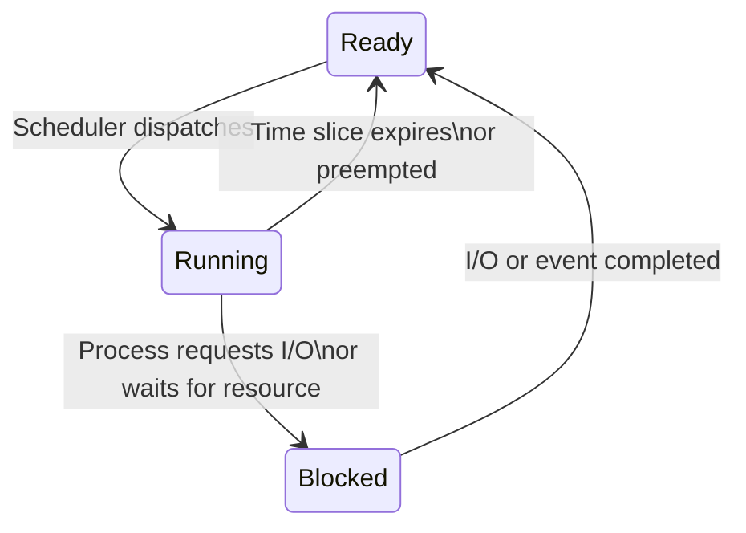

## Purpose and Functions of an Operating System

The **Operating System (OS)** is the most important piece of **system software** on a computer. It acts as an intermediary between the **user**, **application software**, and the **hardware**. Without an OS, users would need to communicate with the hardware directly using machine code.

<div class="key-term" markdown="1">
An **Operating System** is system software that manages computer hardware resources, provides common services for application programs, and acts as an interface between the user and the hardware.
</div>

### Key Functions of an Operating System

| Function | Description |
|---|---|
| **Memory management** | Allocates and deallocates RAM to processes; manages virtual memory, paging, and segmentation |
| **Processor (CPU) management** | Schedules processes to use the CPU; handles multitasking by switching between processes |
| **File management** | Organises files into directories/folders; manages file creation, deletion, renaming, access permissions, and storage allocation on disk |
| **I/O device management** | Manages communication with peripheral devices through device drivers; handles data transfer between devices and memory |
| **User interface** | Provides a way for users to interact with the computer (GUI, CLI, or natural language interface) |
| **Security and access control** | Manages user accounts, authentication (passwords, biometrics), and access rights to files and resources |
| **Error handling** | Detects and responds to hardware and software errors, displaying appropriate error messages |
| **Networking** | Manages network connections, protocols, and shared resources in networked environments |
| **Interrupt handling** | Detects, prioritises, and processes interrupts from hardware and software |

### Resource Management

The OS is fundamentally a **resource manager**. The main resources it manages are:
- **Processor time** — which process gets to use the CPU and for how long
- **Memory (RAM)** — which process gets which portion of memory
- **I/O devices** — coordinating access to printers, disks, network interfaces, etc.
- **Storage** — managing where files are stored on disk and how space is allocated

<div class="exam-tip" markdown="1">
In exam questions about OS functions, think of the OS as a **resource manager** that controls access to the CPU, memory, storage, and I/O devices. Every function relates back to managing one or more of these resources.
</div>

---

## Memory Management

Memory management is one of the most critical functions of the OS. It involves allocating blocks of **RAM** to processes that need them and reclaiming memory when processes finish. The OS must ensure that processes do not interfere with each other's memory.

### Paging

**Paging** divides both **physical memory** (RAM) and **logical memory** (the program) into fixed-size blocks:
- Physical memory is divided into **page frames** (fixed-size slots in RAM)
- A program's logical address space is divided into **pages** of the same size
- Pages are loaded into any available page frames — they do **not** need to be contiguous

The OS maintains a **page table** for each process that maps logical page numbers to physical frame numbers.

**How paging works:**
1. A process is divided into equal-sized pages (e.g., 4 KB each)
2. RAM is divided into page frames of the same size
3. Pages are loaded into any available frame
4. The page table translates logical addresses to physical addresses at runtime

| Advantage | Disadvantage |
|---|---|
| Eliminates external fragmentation (no gaps between allocations) | Can cause **internal fragmentation** — the last page may not fill its frame completely |
| Simple allocation — any frame can hold any page | Page table itself uses memory |
| Allows non-contiguous allocation | Page faults (accessing a page not in RAM) cause delays |

### Segmentation

**Segmentation** divides a program into **logical, variable-sized blocks** called **segments**. Each segment represents a meaningful part of the program, such as:
- The **code** segment (instructions)
- The **data** segment (variables)
- The **stack** segment (function calls and local variables)
- The **heap** segment (dynamically allocated memory)

The OS maintains a **segment table** that stores the base address and length of each segment.

| Advantage | Disadvantage |
|---|---|
| Segments correspond to logical divisions of the program, making it easier to manage | Can cause **external fragmentation** (gaps of free memory between segments) |
| Sharing of segments between processes is straightforward | Variable sizes make allocation more complex |
| Protection can be applied per segment (e.g., code segment is read-only) | Segments must be contiguous in memory |

### Paging vs Segmentation

| Feature | Paging | Segmentation |
|---|---|---|
| **Block size** | Fixed (e.g., 4 KB) | Variable (depends on program structure) |
| **Basis** | Physical division of memory | Logical division of program |
| **Fragmentation** | Internal fragmentation (wasted space in last page) | External fragmentation (gaps between segments) |
| **Programmer awareness** | Invisible to programmer | Programmer-aware (logical divisions) |
| **Sharing** | More difficult | Easier (share a whole segment) |
| **Table used** | Page table | Segment table |

### Virtual Memory

**Virtual memory** is a technique that uses a portion of **secondary storage** (e.g., hard drive or SSD) as an extension of RAM. This allows the computer to run programs that are **larger than the available physical RAM** by keeping only the currently needed pages in RAM and storing the rest on disk.

<div class="key-term" markdown="1">
**Virtual memory** uses secondary storage to extend the apparent size of RAM. Pages of a program are swapped between RAM and disk as needed, managed by the OS.
</div>

**How virtual memory works:**
1. The program is divided into pages
2. Only the pages currently being executed are loaded into RAM
3. The remaining pages are stored in a **swap file** (or page file) on the hard drive
4. When a required page is not in RAM (**page fault**), the OS:
   - Finds a page in RAM that is not currently needed
   - Writes it to disk (if modified) — this is called **swapping out**
   - Loads the required page from disk into the freed frame — this is called **swapping in**

**Thrashing** occurs when the system spends more time swapping pages in and out than executing useful instructions. This happens when there is insufficient RAM and too many processes are competing for memory.

| Advantage | Disadvantage |
|---|---|
| Programs can be larger than physical RAM | Accessing disk is **much slower** than accessing RAM |
| More processes can run simultaneously | Thrashing degrades performance severely |
| Programs do not need to know the physical memory size | Requires disk space for the swap file |
| Efficient use of limited RAM | Page faults add overhead |

<div class="exam-tip" markdown="1">
Virtual memory does **not** increase the amount of physical RAM — it uses secondary storage to **simulate** having more RAM. Remember that **thrashing** is the key problem that occurs when virtual memory is overused.
</div>

---

## Process Scheduling

In a modern multitasking system, multiple processes compete for CPU time. The **scheduler** (part of the OS) decides which process in the **ready queue** should be given the CPU next. The goal is to make efficient use of the CPU and provide a fair, responsive system.

<div class="key-term" markdown="1">
**Process scheduling** is the method by which the OS determines the order in which processes receive CPU time. The **scheduler** selects a process from the ready queue to move to the running state.
</div>

### Scheduling Objectives

- **Maximise CPU utilisation** — keep the CPU busy as much as possible
- **Maximise throughput** — complete as many processes as possible per unit of time
- **Minimise waiting time** — reduce the time processes spend in the ready queue
- **Minimise response time** — reduce the time between a request and the first response
- **Fairness** — ensure every process gets a reasonable share of CPU time
- **Avoid starvation** — ensure no process waits indefinitely

### Scheduling Algorithms

### First Come First Served (FCFS)

Processes are executed in the **order they arrive** in the ready queue. The first process to request the CPU gets it and runs to completion (non-preemptive).

| Advantage | Disadvantage |
|---|---|
| Simple to implement | **Convoy effect** — short processes stuck behind a long process |
| Fair in order of arrival | Long average waiting time |
| No starvation | Not suitable for time-sharing (interactive) systems |

**Example:**

| Process | Arrival Time | Burst Time |
|---|---|---|
| P1 | 0 | 8 |
| P2 | 1 | 4 |
| P3 | 2 | 2 |

**Execution order:** P1 (0-8), P2 (8-12), P3 (12-14)

Waiting times: P1 = 0, P2 = 7, P3 = 10. Average = (0 + 7 + 10) / 3 = **5.67**

### Shortest Job First (SJF)

The process with the **shortest estimated execution time** (burst time) is selected next. Can be **non-preemptive** (once a process starts, it runs to completion) or **preemptive** (a shorter arriving process can interrupt the current one).

| Advantage | Disadvantage |
|---|---|
| Minimises average waiting time (optimal) | Difficult to predict burst time accurately |
| Efficient for batch processing | **Starvation** — long processes may never execute if short ones keep arriving |
| Good throughput | Not practical for interactive systems |

**Example (non-preemptive, all arrive at time 0):**

| Process | Burst Time |
|---|---|
| P1 | 8 |
| P2 | 4 |
| P3 | 2 |

**Execution order:** P3 (0-2), P2 (2-6), P1 (6-14)

Waiting times: P3 = 0, P2 = 2, P1 = 6. Average = (0 + 2 + 6) / 3 = **2.67**

### Round Robin (RR)

Each process is given a small, fixed amount of CPU time called a **time slice** (or **quantum**), typically 10-100 milliseconds. If the process does not finish within its time slice, it is moved to the **back of the ready queue** and the next process gets the CPU.

| Advantage | Disadvantage |
|---|---|
| **Fair** — every process gets equal CPU time | Higher average waiting time than SJF |
| Good for **time-sharing** (interactive) systems | Performance depends on time slice size |
| No starvation — every process is guaranteed CPU time | Context switching adds overhead |
| Good response time for interactive users | Too small a time slice = excessive context switching; too large = behaves like FCFS |

**Example (time slice = 3):**

| Process | Burst Time |
|---|---|
| P1 | 8 |
| P2 | 4 |
| P3 | 2 |

**Execution trace:**

| Time | Running | Ready Queue | Notes |
|---|---|---|---|
| 0-2 | P3 | P1, P2 | P3 finishes (burst = 2 < quantum) |
| 2-5 | P1 | P2 | P1 runs for 3 (5 remaining) |
| 5-8 | P2 | P1 | P2 runs for 3 (1 remaining) |
| 8-11 | P1 | P2 | P1 runs for 3 (2 remaining) |
| 11-12 | P2 | P1 | P2 runs for 1 (finishes) |
| 12-14 | P1 | — | P1 runs for 2 (finishes) |

### Priority Scheduling

Each process is assigned a **priority value**. The process with the **highest priority** is selected next. Can be preemptive or non-preemptive.

| Advantage | Disadvantage |
|---|---|
| Important/urgent processes run first | **Starvation** — low-priority processes may never run |
| Flexible — priority can be set based on various criteria | Requires a mechanism to assign and manage priorities |
| Suitable for real-time systems | Priority inversion can occur (low-priority process holds a resource needed by high-priority) |

**Solution to starvation:** **Ageing** — gradually increase the priority of processes that have been waiting a long time.

### Multilevel Feedback Queue

This is the most sophisticated scheduling algorithm. It uses **multiple queues**, each with a different priority level and scheduling algorithm. Processes can **move between queues** based on their behaviour.

**How it works:**
1. New processes enter the **highest-priority queue**
2. If a process uses its full time slice without finishing, it is moved to a **lower-priority queue** (with a longer time slice)
3. Processes that frequently do I/O (interactive) stay in higher-priority queues
4. CPU-intensive processes gradually drop to lower-priority queues
5. Ageing can be used to promote processes that have waited too long

| Advantage | Disadvantage |
|---|---|
| Adapts to process behaviour automatically | Most complex to implement |
| Favours interactive processes (good response time) | Requires careful tuning of queue parameters |
| Prevents starvation through ageing | Higher overhead for managing multiple queues |
| Balances needs of different process types | |

### Comparison of Scheduling Algorithms

| Algorithm | Type | Starvation? | Best For |
|---|---|---|---|
| **FCFS** | Non-preemptive | No | Simple batch systems |
| **SJF** | Non-preemptive / Preemptive | Yes (long jobs) | Batch processing, minimising wait time |
| **Round Robin** | Preemptive | No | Time-sharing, interactive systems |
| **Priority** | Non-preemptive / Preemptive | Yes (low priority) | Real-time systems, urgent tasks |
| **Multilevel Feedback** | Preemptive | No (with ageing) | General-purpose OS (most modern systems) |

<div class="exam-tip" markdown="1">
You should be able to **trace the execution** of processes through each scheduling algorithm given a table of processes with arrival times and burst times. Round Robin is especially common in exam questions — remember to track remaining burst times and the ready queue after each time slice.
</div>

---

## Process States

A **process** is a program that is currently being executed. At any point in time, a process is in one of three main states. The OS manages transitions between these states.

<div class="key-term" markdown="1">
A **process** is a program in execution. The three main process states are **Ready**, **Running**, and **Blocked (Waiting)**.
</div>

### The Three Process States

| State | Description |
|---|---|
| **Ready** | The process is loaded into memory and is waiting for CPU time. It has all the resources it needs except the CPU. |
| **Running** | The process is currently being executed by the CPU. Only **one** process can be in the running state per CPU core at any time. |
| **Blocked (Waiting)** | The process is waiting for an external event to complete before it can continue, such as I/O (e.g., waiting for data from disk, user input, or a network response). |

### State Transitions



| Transition | From → To | Cause |
|---|---|---|
| **Dispatch** | Ready → Running | The scheduler selects this process to use the CPU |
| **Time-out / Preempt** | Running → Ready | Time slice expires (Round Robin) or a higher-priority process arrives |
| **Block / Wait** | Running → Blocked | The process requests I/O or waits for a resource |
| **Wake up** | Blocked → Ready | The I/O operation or event completes |

**Important notes:**
- A process **cannot** go directly from Blocked to Running — it must go through Ready first
- A process **cannot** go from Ready to Blocked — it must be Running to request I/O
- The **scheduler** controls the Ready → Running transition
- **Interrupts** or **I/O completion** control the Blocked → Ready transition

<div class="exam-tip" markdown="1">
You must be able to draw the **process state diagram** and explain each transition. A very common exam error is showing a direct transition from Blocked to Running — this is **not valid**. A process must always return to the Ready state before it can run again.
</div>

---

## Interrupts and Interrupt Service Routines

An **interrupt** is a signal sent to the CPU that indicates an event has occurred which requires immediate attention. Interrupts are essential for multitasking, I/O handling, and responding to errors.

<div class="key-term" markdown="1">
An **interrupt** is a signal that temporarily halts the current process so the CPU can handle a higher-priority event. An **Interrupt Service Routine (ISR)** is the special routine that handles a specific type of interrupt.
</div>

### Types of Interrupts

| Type | Source | Examples |
|---|---|---|
| **Hardware interrupts** | External devices | Keyboard key press, mouse click, printer ready, disk read complete, network data received |
| **Software interrupts** | Programs / OS | Division by zero, memory access violation, system call, invalid instruction |
| **Timer interrupts** | System clock | Time slice expired (used by Round Robin scheduling), real-time clock tick |

### The Interrupt Handling Process

The interrupt mechanism works within the **Fetch-Decode-Execute cycle**:

1. A device or software generates an **interrupt signal**
2. The CPU completes the **current instruction** in the Fetch-Decode-Execute cycle
3. The CPU **checks for pending interrupts** at the end of each cycle
4. If an interrupt is detected:
   - The CPU **saves the current state** (contents of all registers, including the Program Counter) to the **system stack**
   - The CPU identifies the interrupt using the **interrupt vector table** — a table that maps each interrupt type to the memory address of its ISR
   - The CPU loads the address of the appropriate **Interrupt Service Routine (ISR)** into the Program Counter
5. The CPU **executes the ISR** to handle the interrupt (e.g., read data from the keyboard buffer)
6. Once the ISR completes, the CPU **restores the saved state** from the stack
7. The CPU **resumes execution** of the original process from where it left off

### Interrupt Priorities

Not all interrupts are equally urgent. The OS assigns **priorities** to different interrupt types:
- **High priority:** Hardware failure, power failure, memory errors
- **Medium priority:** I/O device requests, timer interrupts
- **Low priority:** Software interrupts, user requests

A higher-priority interrupt can **interrupt** a lower-priority ISR. The lower-priority ISR's state is saved to the stack, and it is resumed after the higher-priority interrupt is handled. This is called **nested interrupts**.

### The Role of the Stack in Interrupt Handling

The **stack** is essential for interrupt handling:
- It stores the **return address** (Program Counter value) so the CPU knows where to resume
- It stores the **register contents** so the CPU state can be fully restored
- For nested interrupts, each interrupted routine's state is pushed onto the stack and popped off in reverse order (LIFO)

<div class="exam-tip" markdown="1">
The interrupt handling process is a very common exam topic. Make sure you can describe all the steps in order, including saving the state to the stack, using the interrupt vector table, executing the ISR, and restoring the state. Emphasise the role of the **stack** in preserving and restoring the CPU state.
</div>

---

## Types of Operating System

Different types of OS are designed for different computing environments and requirements.

### Batch Operating System

A **batch OS** collects and groups similar jobs together (a "batch") and processes them one after another **without user interaction** during execution. Jobs are submitted and processed when resources are available.

- **Example:** Payroll processing, billing systems, bank statement generation
- **Advantage:** Efficient use of resources for repetitive, similar jobs
- **Disadvantage:** No user interaction; errors are only detected after the entire batch has been processed

### Real-Time Operating System (RTOS)

A **real-time OS** processes data and responds **within a guaranteed time frame**. It is used in systems where delayed response could be dangerous or unacceptable.

There are two types:
- **Hard real-time:** Missing a deadline causes system failure (e.g., airbag deployment, nuclear reactor control, pacemaker)
- **Soft real-time:** Missing a deadline degrades performance but is not catastrophic (e.g., video streaming, online gaming)

- **Advantage:** Guaranteed response times; high reliability
- **Disadvantage:** Complex to develop; limited functionality (focused on specific tasks)

It is important to distinguish between two types of real-time system:

| Feature | Real-Time Transaction Processing | Real-Time Control |
|---------|--------------------------------|-------------------|
| **Purpose** | Process individual transactions immediately | Continuously monitor and control physical processes |
| **Example** | ATM withdrawals, airline booking, point-of-sale | Airbag deployment, nuclear reactor, temperature control |
| **Input** | User-initiated transactions | Sensor data (continuous) |
| **Response** | Must complete within a set time or roll back | Must respond instantly to changing conditions |
| **Failure consequence** | Transaction fails or is reversed | Physical danger or system failure |

### Multi-User Operating System

A **multi-user OS** allows **multiple users** to access the same computer system simultaneously, each with their own terminal or session. The OS manages resource allocation to give each user a fair share.

- **Example:** University server accessed by hundreds of students, mainframe banking systems
- **Advantage:** Efficient sharing of expensive resources; centralised administration
- **Disadvantage:** Requires powerful hardware; complex security management

### Multi-Tasking Operating System

A **multi-tasking OS** allows a single user to run **multiple applications** at the same time. The OS switches between tasks rapidly (context switching) to give the appearance of simultaneous execution.

- **Example:** Running a web browser, word processor, and music player at the same time on a desktop PC
- **Advantage:** Improved productivity; better use of CPU time
- **Disadvantage:** Uses more memory; context switching adds overhead

### Distributed Operating System

A **distributed OS** manages a collection of **independent computers** connected by a network, making them appear as a single system to the user. Tasks can be distributed across multiple machines.

- **Example:** Cloud computing platforms, distributed databases, render farms
- **Advantage:** Scalability; fault tolerance (if one machine fails, others continue); resource sharing
- **Disadvantage:** Complex to design and manage; network dependency; security challenges

### Embedded Operating System

An **embedded OS** is built into a dedicated device and performs a specific set of functions. It typically runs on limited hardware with constrained memory and processing power.

- **Example:** Smart TV, washing machine, car engine management, digital camera
- **Advantage:** Optimised for specific hardware; small and efficient; fast boot time
- **Disadvantage:** Limited functionality; difficult to update

### Comparison of OS Types

| OS Type | Users | Interaction | Key Feature | Example Use |
|---|---|---|---|---|
| **Batch** | Multiple (indirect) | None during processing | Jobs grouped and processed together | Payroll, billing |
| **Real-Time** | Single/Multiple | Immediate | Guaranteed response time | Airbags, medical devices |
| **Multi-User** | Multiple (simultaneous) | Interactive | Shared resources, concurrent access | University servers |
| **Multi-Tasking** | Single | Interactive | Multiple applications simultaneously | Desktop PCs |
| **Distributed** | Multiple | Varies | Multiple computers act as one | Cloud computing |
| **Embedded** | Single (indirect) | Limited/None | Dedicated device, specific task | Washing machine |

<div class="exam-tip" markdown="1">
You may be asked to identify the most suitable type of OS for a given scenario. Focus on the key characteristics: does the system need **guaranteed response times** (real-time), **multiple users** (multi-user), **no user interaction** (batch), or is it a **dedicated device** (embedded)?
</div>

---

## User Interfaces

The **user interface** is the means by which a user interacts with the computer. The OS provides one or more types of interface.

### Command Line Interface (CLI)

A **CLI** allows users to interact with the OS by typing **text commands** at a prompt. The user must know the correct commands and syntax.

**Examples:** Windows Command Prompt, PowerShell, Linux Bash terminal

```python
# Example CLI commands (Linux/Mac):
# ls              — list files in current directory
# cd Documents    — change to Documents directory
# mkdir NewFolder — create a new directory
# cp file1.txt file2.txt — copy a file
# rm file1.txt   — delete a file
```

### Graphical User Interface (GUI)

A **GUI** uses visual elements — **windows, icons, menus, and pointers (WIMP)** — to allow users to interact with the computer using a mouse, touchpad, or touchscreen.

**Examples:** Windows desktop, macOS Finder, Android home screen

### CLI vs GUI Comparison

| Feature | CLI | GUI |
|---|---|---|
| **Ease of use** | Difficult for beginners — must learn commands | Intuitive — visual, point-and-click |
| **Speed** | Faster for experienced users | Slower for repetitive tasks |
| **Resource usage** | Low — text-based, minimal RAM and processing | High — graphical rendering requires more resources |
| **Precision** | High — exact commands with parameters | Lower — limited to available menu options |
| **Automation** | Easy — commands can be scripted (batch files, shell scripts) | Difficult to automate |
| **Error-prone** | Typing mistakes cause errors | Less error-prone (guided choices) |
| **Accessibility** | Poor for non-technical users | Good — designed for general users |
| **Remote access** | Excellent — low bandwidth required | Requires more bandwidth for remote desktop |
| **Best for** | System administrators, developers, servers | General users, creative applications |

### Natural Language Interface (NLI)

A **natural language interface** allows users to interact using **everyday spoken or written language**. The system interprets the user's intent and responds accordingly.

**Examples:** Siri, Alexa, Google Assistant, ChatGPT

- **Advantage:** Very accessible; no training needed; suitable for users with disabilities
- **Disadvantage:** Can misinterpret commands; limited in complex tasks; requires significant processing power

<div class="exam-tip" markdown="1">
A common exam question asks you to compare CLI and GUI. Structure your answer around **specific criteria** (ease of use, speed, resources, automation) rather than making vague statements. Always explain **why** one is better than the other for a given criterion.
</div>

---

## Device Drivers and BIOS

### Device Drivers

A **device driver** is a specialised piece of software that allows the OS to communicate with a specific hardware device. Each device requires its own driver because different devices have different commands and communication protocols.

<div class="key-term" markdown="1">
A **device driver** is software that translates generic OS commands into specific instructions that a particular hardware device can understand and execute.
</div>

**How device drivers work:**
1. An application sends a generic request to the OS (e.g., "print this document")
2. The OS passes the request to the appropriate **device driver**
3. The device driver translates the request into **device-specific commands**
4. The hardware device receives and executes the commands
5. The device driver reports the result back to the OS

**Key points about device drivers:**
- Each hardware device needs a **specific driver** for the OS it is being used with
- Drivers are usually provided by the **hardware manufacturer**
- Drivers must be **updated** when the OS is updated or when bugs are found
- Incorrect or outdated drivers can cause system instability or hardware malfunction
- The OS maintains a library of common drivers but may need additional drivers for specialist hardware

### BIOS (Basic Input/Output System)

The **BIOS** (or its modern replacement, **UEFI**) is firmware stored on a **ROM chip** on the motherboard. It is the first software that runs when the computer is switched on.

**Functions of the BIOS:**
1. **Power-On Self-Test (POST)** — tests that essential hardware components are present and functioning (CPU, RAM, keyboard, storage devices)
2. **Bootstrap loader** — locates and loads the OS from secondary storage into RAM
3. **Hardware configuration** — provides basic settings for hardware components (date/time, boot order, CPU settings)
4. **Basic I/O services** — provides low-level routines for communicating with hardware before device drivers are loaded

**Boot sequence:**
1. Computer is powered on
2. BIOS runs the **POST** to check hardware
3. BIOS reads the **boot order** to determine which storage device to load the OS from
4. BIOS locates the **boot sector** on the selected device
5. The **bootstrap loader** loads the OS kernel into RAM
6. The OS takes control and loads device drivers, starts services, and presents the user interface

<div class="exam-tip" markdown="1">
Remember the BIOS runs **before** the OS. Its job is to test the hardware (POST) and then **load the OS** into memory. Without the BIOS, the computer would not know where to find the operating system.
</div>

---

## Utility Software

**Utility software** consists of system programs that perform specific **maintenance and housekeeping tasks** to keep the computer running efficiently. Utilities are not part of the OS kernel but often come bundled with the OS.

<div class="key-term" markdown="1">
**Utility software** is system software that performs specific maintenance, optimisation, or security tasks to support the efficient operation of the computer system.
</div>

### Common Utility Programs

| Utility | Purpose | Details |
|---|---|---|
| **Disk defragmenter** | Reorganises fragmented files on a hard disk | Files become fragmented over time (parts stored in non-contiguous locations). Defragmentation moves file fragments so they are stored contiguously, improving read speed. Not needed for SSDs. |
| **Disk formatter** | Prepares a storage device for use | Sets up the file system structure (e.g., NTFS, FAT32, ext4) so the OS can read and write files |
| **File compression** | Reduces file size | Uses algorithms to encode data more efficiently. Reduces storage space and speeds up file transfer. Can be lossy (some data lost) or lossless (original data fully recoverable). |
| **Antivirus / Anti-malware** | Detects and removes malicious software | Scans files and memory for known malware signatures and suspicious behaviour. Requires regular updates to its virus definition database. |
| **Firewall** | Monitors and controls network traffic | Blocks unauthorised incoming/outgoing connections based on security rules. Can be software-based or hardware-based. |
| **Backup utility** | Creates copies of data for recovery | Supports full, incremental, and differential backups. Essential for disaster recovery. |
| **Encryption utility** | Protects data by encoding it | Converts plaintext to ciphertext so only authorised users with the decryption key can read it. Used for sensitive files, emails, and disk encryption. |
| **File manager** | Organises files and folders | Allows users to create, rename, move, copy, and delete files and directories. |
| **System monitor** | Displays system performance information | Shows CPU usage, memory usage, disk activity, network traffic, and running processes. Helps diagnose performance issues. |

### Why Utility Software is Needed

- **Performance** — defragmentation and disk cleanup keep the system running efficiently
- **Security** — antivirus, firewalls, and encryption protect against threats
- **Storage management** — compression and backup utilities manage limited storage space
- **Reliability** — backup utilities ensure data can be recovered after failure
- **Maintenance** — regular use of utilities extends the useful life of the system

<div class="exam-tip" markdown="1">
Be able to **name, describe, and justify** the use of specific utility programs for given scenarios. For example, if asked "how can a company protect sensitive data on employee laptops?", you might suggest **encryption utilities** (to protect data if the laptop is stolen) and **backup utilities** (to recover data if the laptop is lost or damaged).
</div>

---

## Buffering

<div class="key-term" markdown="1">
A **buffer** is a temporary storage area in memory used to hold data that is being transferred between two devices or processes that operate at different speeds.
</div>

Buffering is needed because the CPU operates much faster than I/O devices (printers, disks, network connections). Without buffering, the CPU would have to **wait idle** until the slower device was ready.

### Single Buffering

- Data is placed in **one buffer** by the producing device/process
- The consuming device/process reads from the same buffer
- The producer must **wait** until the consumer has finished reading before writing new data
- Simple but can leave the CPU or I/O device idle while waiting

### Double Buffering

- **Two buffers** are used alternately
- While one buffer is being **read** by the consumer, the other is being **filled** by the producer
- When both are done, the buffers **swap roles**
- This allows the CPU and I/O device to work **simultaneously**, significantly improving throughput
- Used in audio/video streaming, printing, and disk I/O

| Feature | Single Buffering | Double Buffering |
|---------|-----------------|------------------|
| **Buffers used** | 1 | 2 |
| **Concurrency** | Producer and consumer take turns | Producer and consumer work simultaneously |
| **Efficiency** | Lower — one device may be idle | Higher — both devices stay busy |
| **Complexity** | Simple | Slightly more complex |

### Spooling

**Spooling (Simultaneous Peripheral Operations On-Line)** is a specific form of buffering used for slow output devices like printers. Print jobs are stored in a **spool queue** on disk, and the printer processes them one at a time while the CPU continues with other tasks.

---

## Polling

<div class="key-term" markdown="1">
**Polling** is a technique where the CPU repeatedly checks (polls) each I/O device in turn to see if it needs attention or has data ready.
</div>

### How Polling Works

1. The CPU cycles through each connected device in sequence
2. For each device, it checks a **status flag** to see if the device needs service
3. If the flag is set, the CPU handles the request
4. If not, it moves to the next device

### Polling vs Interrupts

| Feature | Polling | Interrupts |
|---------|---------|------------|
| **Mechanism** | CPU actively checks each device | Device sends a signal to the CPU |
| **CPU efficiency** | Wastes CPU time checking devices that don't need attention | CPU only responds when needed |
| **Simplicity** | Simpler to implement | More complex (interrupt vector table, ISRs) |
| **Response time** | Can be slow (depends on polling frequency) | Fast (immediate notification) |
| **Best for** | Simple systems with few devices | Complex systems with many devices |

<div class="exam-tip" markdown="1">
Polling is generally considered **less efficient** than interrupts because the CPU wastes time checking devices that may not need attention. However, polling is simpler to implement and can be suitable for **embedded systems** with a small number of devices.
</div>

---

## Threading

<div class="key-term" markdown="1">
A **thread** is the smallest unit of processing that can be scheduled by the OS. A single process can contain **multiple threads** that share the same memory space but execute independently.
</div>

### Processes vs Threads

| Feature | Process | Thread |
|---------|---------|--------|
| **Memory** | Has its own separate memory space | Shares memory with other threads in the same process |
| **Creation** | Heavyweight — slow to create | Lightweight — fast to create |
| **Communication** | Complex (inter-process communication needed) | Simple (shared memory) |
| **Isolation** | Failure in one process does not affect others | Failure in one thread can crash the whole process |
| **Context switch** | Expensive (save/restore full memory state) | Cheaper (only save/restore thread-specific state) |

### Multithreading

**Multithreading** means running multiple threads within a single process concurrently. Benefits include:

- **Improved responsiveness** — a GUI application can keep the interface responsive while performing background tasks (e.g. downloading a file)
- **Better resource utilisation** — on multi-core CPUs, different threads can execute on different cores simultaneously
- **Faster execution** — tasks that can be parallelised (e.g. processing different parts of an image) complete faster
- **Simplified program structure** — complex tasks can be broken into simpler concurrent threads

### Example: Web Browser

A web browser typically uses multiple threads:
- One thread for **rendering the page**
- One thread for **downloading images**
- One thread for **running JavaScript**
- One thread for **handling user input**

This allows the browser to remain responsive while loading content.

<div class="exam-tip" markdown="1">
Understand the difference between **processes** and **threads**. A process is an independent program with its own memory. A thread is a lightweight execution unit within a process that shares memory with other threads. Multithreading improves performance and responsiveness, especially on multi-core processors.
</div>
