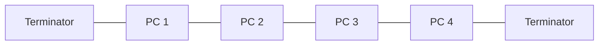
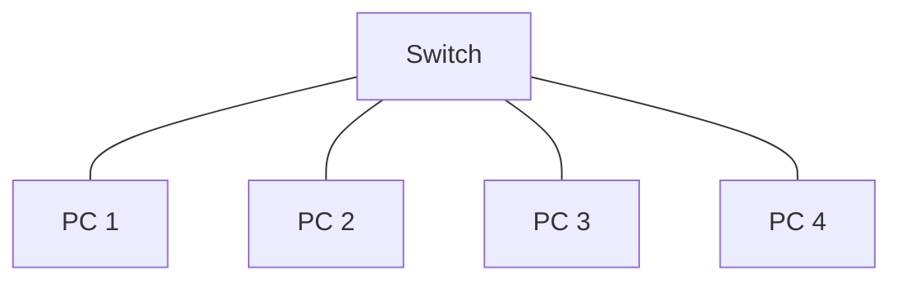
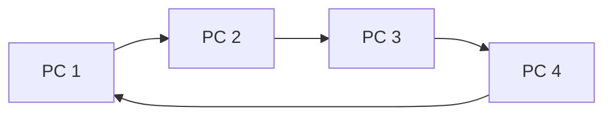
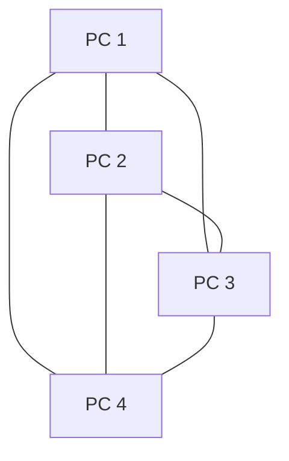

## Networks: Characteristics and importance of LAN and WAN

A **computer network** is two or more devices connected together so they can communicate and share resources.

### LAN (Local Area Network)

- Covers a **small geographical area** — a single building or site (e.g. a school or office)
- Hardware is **owned and maintained** by the organisation that uses it
- Uses cables (Ethernet), Wi-Fi, or a combination of both
- Typically offers **high data transfer speeds** and **low latency**

### WAN (Wide Area Network)

- Covers a **large geographical area** — across cities, countries, or even the globe
- Often uses infrastructure **owned by third parties** such as telecommunications companies
- The **internet** is the largest example of a WAN
- Generally **slower** and **more expensive** than a LAN due to the distances involved

| Feature | LAN | WAN |
|---------|-----|-----|
| Geographical area | Small (one site) | Large (multiple sites) |
| Ownership | Owned by the organisation | Uses third-party infrastructure |
| Speed | High | Lower |
| Cost | Lower setup and running costs | Higher (leasing lines) |
| Example | School network | The internet |

### PAN (Personal Area Network)

- Covers a **very small area** — typically within a few metres of an individual
- Used to connect **personal devices** such as smartphones, tablets, headphones, and smartwatches
- Often uses **Bluetooth** or **USB** connections
- Low power consumption and short range
- Example: connecting wireless earbuds to a phone

### MAN (Metropolitan Area Network)

- Covers a **city-wide area** — larger than a LAN but smaller than a WAN
- Connects **multiple LANs** across a town or city
- Often managed by a single organisation or local authority
- Uses high-speed connections such as **fibre optic cables**
- Example: a city council linking all its offices and libraries across the city

### VPN (Virtual Private Network)

- Creates a **secure, encrypted tunnel** over a **public network** (such as the internet)
- Allows users to send and receive data as if they were directly connected to a private network
- Commonly used for **remote working** — employees can securely access company resources from home
- Also used for **privacy** — hides the user's IP address and encrypts all traffic
- Data is **encrypted before transmission** and **decrypted at the other end**

| Feature | PAN | LAN | MAN | WAN | VPN |
|---------|-----|-----|-----|-----|-----|
| Geographical area | Very small (a few metres) | Small (one site) | City-wide | Large (multiple sites) | Virtual — uses existing networks |
| Typical technology | Bluetooth, USB | Ethernet, Wi-Fi | Fibre optic | Leased lines, satellite | Encrypted tunnel over internet |
| Ownership | Individual | Organisation | Organisation or local authority | Third-party infrastructure | Organisation (software-based) |
| Example | Phone to earbuds | School network | City council network | The internet | Employee working from home |

**LAN** — a network confined to a small area, owned and managed by one organisation. **WAN** — a network spanning a large area, often using infrastructure from telecommunications providers. **PAN** — a very small network connecting personal devices, typically using Bluetooth. **MAN** — a network spanning a city, connecting multiple LANs. **VPN** — a secure, encrypted connection over a public network that allows private data to be sent safely.

Do not confuse a VPN with a physical network type. A VPN is a **virtual** network — it does not require its own cables or infrastructure. It works by creating an encrypted tunnel over an existing network such as the internet.

### Why networks are important

- **Resource sharing** — printers, internet connections, and storage can be shared
- **Communication** — email, messaging, and video calls between users
- **Centralised data** — files stored on a server can be accessed from any workstation
- **Centralised management** — software updates and security policies applied from one place
- **Cost savings** — fewer peripherals needed; software licences can be shared

---

## Network topologies: Ring, star, bus, mesh (advantages/disadvantages)

A **network topology** is the arrangement of devices (nodes) and connections (links) in a network. It can refer to the physical layout or the logical path data takes.

### Bus Topology

All devices are connected to a single **backbone cable**. Data is sent in both directions along the cable, and each device checks whether the data is addressed to it.

- A **terminator** is required at each end to prevent signal reflection

| Advantages | Disadvantages |
|------------|---------------|
| Cheap and easy to set up | If the backbone cable fails, the entire network goes down |
| Requires less cabling than star | Performance drops as more devices are added (collisions) |
| Good for small, temporary networks | Difficult to troubleshoot faults |
| | Limited cable length and number of devices |

### Star Topology

All devices are connected to a **central switch or hub**. All data passes through this central device.

| Advantages | Disadvantages |
|------------|---------------|
| If one cable fails, only that device is affected | If the central switch fails, the whole network goes down |
| Easy to add new devices | Requires more cabling than bus |
| Better performance — no data collisions (with a switch) | More expensive due to the switch/hub |
| Easy to troubleshoot | |

### Ring Topology

Each device is connected to **two other devices**, forming a circular loop. Data travels in **one direction** around the ring.

| Advantages | Disadvantages |
|------------|---------------|
| Data flows in one direction, reducing collisions | If one device or cable fails, the whole network can go down |
| Each device has equal access to the network | Difficult to troubleshoot |
| Performs well under heavy load | Adding or removing devices disrupts the network |

### Mesh Topology

Every device is connected to **every other device** (full mesh) or to **several other devices** (partial mesh). Data can take multiple paths.

| Advantages | Disadvantages |
|------------|---------------|
| Very reliable — if one link fails, data takes another route | Expensive — requires a lot of cabling and network ports |
| No single point of failure | Complex to set up and manage |
| Can handle high traffic volumes | Impractical for large numbers of devices (full mesh) |

When asked to recommend a topology, consider the scenario. A small office might use **star** (reliable, easy to manage). A network requiring maximum uptime uses **mesh**. Always justify your choice by linking advantages to the scenario's requirements.

---

## Network hardware: Hub, switch, router, bridge, WAP, NIC

Networks require specialised **hardware devices** to connect computers and manage the flow of data. Each device has a specific role.

### Hub

- Connects multiple devices in a network
- When it receives data, it **broadcasts** the data to **all ports** (every connected device)
- Does **not** read or filter data — every device receives every message
- Creates unnecessary network traffic and is **inefficient**
- Considered **outdated** — largely replaced by switches

### Switch

- Connects multiple devices in a network, like a hub, but is **intelligent**
- Reads the **MAC address** of incoming data and sends it **only to the intended recipient**
- Reduces unnecessary traffic and improves network performance
- Operates at the **Data Link layer** (Layer 2) of the TCP/IP model
- The standard device used in modern **star topology** networks

### Router

- Directs data **between different networks** (e.g. from a LAN to the internet)
- Reads the **destination IP address** of each packet and determines the best route
- Uses a **routing table** to make forwarding decisions
- Operates at the **Network layer** (Layer 3) of the TCP/IP model
- Essential for connecting a home or office network to the internet

### Bridge

- Connects **two network segments** and allows them to function as a single network
- Filters traffic by reading **MAC addresses**, only forwarding data that needs to cross between segments
- Reduces network congestion by keeping local traffic within its segment
- Simpler and less capable than a switch

### WAP (Wireless Access Point)

- Allows **wireless devices** to connect to a **wired network**
- Acts as a bridge between Wi-Fi devices and the wired LAN
- Broadcasts a **wireless signal** (SSID) that devices can connect to
- Often built into home routers, but can also be standalone devices in larger networks
- Uses encryption (WPA2/WPA3) to secure wireless connections

### NIC (Network Interface Card)

- A piece of **hardware** installed in a device that allows it to connect to a network
- Each NIC has a unique **MAC address** burned into it by the manufacturer
- Can be **wired** (Ethernet port) or **wireless** (Wi-Fi adapter)
- Without a NIC, a device **cannot** communicate on a network
- Modern devices (laptops, phones) have NICs built in

| Device | Function | Addresses Used | Key Characteristic |
|--------|----------|----------------|-------------------|
| **Hub** | Connects devices; broadcasts data to all ports | None | Outdated; inefficient |
| **Switch** | Connects devices; sends data only to the intended recipient | MAC addresses | Intelligent; reduces traffic |
| **Router** | Directs traffic between different networks | IP addresses | Finds best route for packets |
| **Bridge** | Connects two network segments | MAC addresses | Filters traffic between segments |
| **WAP** | Connects wireless devices to a wired network | MAC addresses | Broadcasts wireless signal |
| **NIC** | Allows a device to connect to a network | Has a unique MAC address | Required hardware for networking |

**Hub** — broadcasts data to all connected devices. **Switch** — sends data only to the intended device using MAC addresses. **Router** — directs packets between networks using IP addresses. **Bridge** — connects two network segments. **WAP** — allows wireless devices to join a wired network. **NIC** — hardware in a device that enables network connectivity, identified by a unique MAC address.

The most common confusion is between a **hub** and a **switch**. A hub broadcasts to all devices (wasteful), while a switch reads the MAC address and forwards data only to the correct device (efficient). Also remember: **switches** use MAC addresses (Layer 2) and **routers** use IP addresses (Layer 3).

---

## Connectivity: Wired and wireless importance

Networks can use **wired** or **wireless** connections, and most modern networks use a combination of both.

### Wired Connections

- Use physical cables such as **Ethernet (copper twisted pair)** or **fibre optic**
- Provide **faster, more reliable** data transfer with lower latency
- More **secure** — data is harder to intercept without physical access
- Less convenient — devices must be near a cable point and cannot move freely

### Wireless Connections

- Use **radio waves** (Wi-Fi, Bluetooth) or **infrared** to transmit data
- Allow **mobility** — users can connect from anywhere within range
- Easier to set up — no cabling needed
- **Slower and less reliable** than wired — subject to interference, walls, and distance limitations
- Less secure — signals can be intercepted; encryption (WPA2/WPA3) is essential

| Feature | Wired | Wireless |
|---------|-------|----------|
| Speed | Faster | Slower |
| Reliability | Very reliable | Can be affected by interference |
| Security | More secure | Requires encryption |
| Mobility | Fixed position | Free movement within range |
| Cost of cabling | Higher | Lower |

**Ethernet** — the most common wired networking standard, using copper or fibre optic cables. **Wi-Fi** — a wireless networking standard that uses radio waves to connect devices to a network.

---

## Circuit switching and packet switching (advantages/disadvantages)

There are two main methods for transmitting data across a network.

### Circuit Switching

A **dedicated communication path** is established between sender and receiver for the **entire duration** of the transmission. The channel is reserved even if no data is being sent at that moment.

- Used in traditional **telephone networks**
- The path is set up, data is transmitted, and then the path is released

| Advantages | Disadvantages |
|------------|---------------|
| Dedicated path gives consistent, reliable connection | Inefficient — the channel is reserved even during silence |
| Data arrives in order — no reassembly needed | If the path fails, the connection is lost |
| Suitable for real-time communication (voice calls) | Takes time to establish the circuit before data can flow |
| | Only two devices can use the circuit at a time |

### Packet Switching

Data is broken into small **packets**, each with its own header containing source, destination, and sequence number. Packets are sent **independently** across the network and may take **different routes**. They are **reassembled** at the destination.

- Used on the **internet**
- Routers direct each packet along the best available route

| Advantages | Disadvantages |
|------------|---------------|
| Efficient — bandwidth is shared among many users | Packets may arrive out of order and need reassembly |
| If one route fails, packets can take alternative routes | Delay (latency) can occur if the network is busy |
| No need to establish a connection first | Not ideal for real-time communication without extra protocols |
| Multiple communications can share the same lines | Overhead from packet headers uses some bandwidth |

If asked to compare the two, link your answer to the scenario. Circuit switching suits **real-time voice calls** where a constant connection is needed. Packet switching suits **internet browsing and email** where efficiency and resilience matter more than constant connection.

---

## Protocols: Ethernet, Wi-Fi, TCP/IP, HTTP, HTTPS, FTP, email protocols

A **protocol** is a set of rules that governs how data is transmitted and received across a network. Without agreed protocols, devices from different manufacturers could not communicate.

| Protocol | Full Name | Purpose |
|----------|-----------|---------|
| **Ethernet** | — | Wired LAN communication; defines how data is formatted and transmitted over cables |
| **Wi-Fi** | — | Wireless LAN communication using radio waves |
| **TCP/IP** | Transmission Control Protocol / Internet Protocol | Foundation of the internet; TCP ensures reliable delivery, IP handles addressing and routing |
| **HTTP** | HyperText Transfer Protocol | Transfers web pages from server to browser (unencrypted) |
| **HTTPS** | HyperText Transfer Protocol Secure | Encrypted version of HTTP using SSL/TLS; used for secure transactions |
| **FTP** | File Transfer Protocol | Transfers files between computers on a network |
| **SMTP** | Simple Mail Transfer Protocol | Sends outgoing emails from client to server and between servers |
| **POP3** | Post Office Protocol v3 | Downloads emails from server to client; usually deletes from server |
| **IMAP** | Internet Message Access Protocol | Accesses and manages emails on the server; keeps emails on server and syncs across devices |

**Protocol** — a set of agreed rules and standards that allow devices to communicate across a network. Every device on the network must follow the same protocols for successful data exchange.

Know the difference between POP3 and IMAP. **POP3** downloads and removes emails from the server (good for one device). **IMAP** keeps emails on the server and syncs across multiple devices (better for modern use with phones and laptops).

---

## Typical contents of a TCP/IP packet

When data is sent using TCP/IP, it is broken into **packets**. Each packet contains:

### Packet Header

| Field | Purpose |
|-------|---------|
| **Source IP address** | The IP address of the sending device |
| **Destination IP address** | The IP address of the receiving device |
| **Packet sequence number** | The position of this packet in the overall message, so packets can be reassembled in the correct order |
| **Time to live (TTL)** | The maximum number of hops (routers) the packet can pass through before being discarded — prevents packets circulating forever |
| **Protocol** | Identifies which protocol should handle the packet (e.g. TCP, UDP) |
| **Checksum** | A value used to check whether the data has been corrupted during transmission |

### Payload (Data)

- The actual **chunk of data** being transmitted
- This is a portion of the original file, message, or web page

### Trailer

- Marks the **end of the packet**
- May contain an additional **error-checking value** (e.g. CRC — Cyclic Redundancy Check)

In the exam, you may be asked to label or describe the contents of a packet. Remember the three sections: **header** (addressing and control information), **payload** (the actual data), and **trailer** (end marker and error checking).

---

## Importance of layers and TCP/IP 5-layer model

Network communication is organised into **layers**. Each layer handles a specific part of the communication process and passes data to the layer above or below it.

### Why use layers?

- **Simplifies** complex network communication into manageable parts
- Allows **different technologies** to be used at each layer without affecting others
- Makes **troubleshooting** easier — faults can be isolated to a specific layer
- Enables **standardisation** — different manufacturers can develop compatible products
- Individual layers can be **updated or replaced** without redesigning the whole system

### TCP/IP 5-Layer Model

| Layer | Name | Function | Example Protocols/Hardware |
|-------|------|----------|----------------------------|
| 5 | **Application** | Provides network services to the user (web browsing, email) | HTTP, HTTPS, FTP, SMTP, IMAP |
| 4 | **Transport** | Ensures reliable data delivery; breaks data into segments and reassembles | TCP, UDP |
| 3 | **Network** | Handles addressing and routing packets across networks | IP |
| 2 | **Data Link** | Manages data transfer between devices on the same network; error detection | Ethernet, Wi-Fi |
| 1 | **Physical** | Transmits raw bits over the physical medium (cables, radio waves) | Cables, hubs, radio signals |

### How data moves through the layers

**Sending:** Data starts at the Application layer and moves **down** through each layer. Each layer adds its own **header** (encapsulation) before passing it to the layer below.

**Receiving:** Data arrives at the Physical layer and moves **up** through each layer. Each layer removes its header (de-encapsulation) and passes the data up until it reaches the Application layer.

**Encapsulation** — the process of wrapping data with protocol headers as it moves down through the layers. Each layer adds its own control information. **De-encapsulation** is the reverse process at the receiving end.

---

## Methods of routing traffic and calculating routing costs

**Routers** are devices that direct packets between networks. They use **routing tables** to determine the best path for each packet.

### How routing works

1. A router receives a packet and reads the **destination IP address** from the header
2. It checks its **routing table** to find possible paths to the destination
3. It forwards the packet to the **next router** (next hop) along the best route
4. This process repeats at each router until the packet reaches its destination

### Routing tables

A routing table stores information about:
- **Destination networks** — which networks the router knows about
- **Next hop** — the address of the next router to forward the packet to
- **Cost/metric** — a value representing the "cost" of using that route (based on speed, distance, or congestion)

### Calculating routing costs

In exam questions, you may be given a **network diagram** with costs (weights) on each link. To find the cheapest route, add up the costs along each possible path.

**Example:** To get from Router A to Router D:

- Route 1: A → B → D = cost 3 + cost 5 = **8**
- Route 2: A → C → D = cost 2 + cost 4 = **6**
- Route 3: A → B → C → D = cost 3 + cost 1 + cost 4 = **8**

The **lowest cost route** is A → C → D with a cost of **6**.

When calculating routing costs, list **all possible paths** and add up the costs for each. The correct answer is the path with the **lowest total cost**. Show your working clearly — write out each route and its total.

---

## Internet: DNS servers and IP addresses

### IP Addresses

Every device on a network has a unique **IP (Internet Protocol) address** that identifies it, much like a postal address identifies a house.

- **IPv4** — a 32-bit address written as four numbers separated by dots (e.g. `192.168.1.25`). Each number ranges from 0 to 255. Provides about 4.3 billion unique addresses
- **IPv6** — a 128-bit address written in hexadecimal groups separated by colons (e.g. `2001:0db8:85a3:0000:0000:8a2e:0370:7334`). Created because IPv4 addresses were running out

**IP address** — a unique numerical address assigned to every device on a network, used to identify the device and route data to it. IPv4 uses 32 bits; IPv6 uses 128 bits.

### DNS (Domain Name System)

Humans find it difficult to remember numerical IP addresses, so we use **domain names** instead (e.g. `www.bbc.co.uk`). The **Domain Name System** translates domain names into IP addresses.

### How DNS works

1. A user types a **URL** (e.g. `www.example.com`) into their browser
2. The browser sends a request to a **DNS server**
3. The DNS server looks up the domain name in its records and returns the matching **IP address**
4. If the DNS server does not have the record, it forwards the request to another DNS server higher in the hierarchy
5. The browser uses the IP address to connect to the correct **web server**
6. The web server sends the requested web page back to the browser

### DNS hierarchy

DNS operates as a **distributed database** — no single server holds all records. DNS servers are arranged in a hierarchy:

- **Root servers** — the top level; they direct queries to the correct top-level domain server
- **Top-level domain (TLD) servers** — handle domains like `.com`, `.co.uk`, `.org`
- **Authoritative name servers** — hold the actual IP address records for specific domain names

A common exam question asks you to describe the steps involved in accessing a website. Start with the user entering the URL, then the DNS lookup to convert the domain name to an IP address, then the browser connecting to the web server using that IP address.

